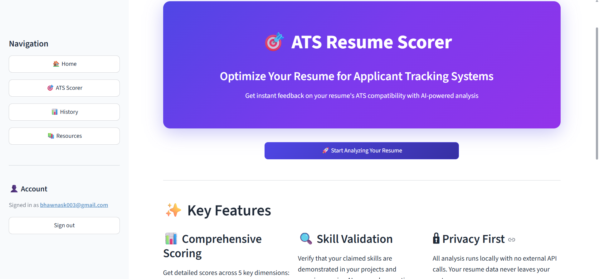
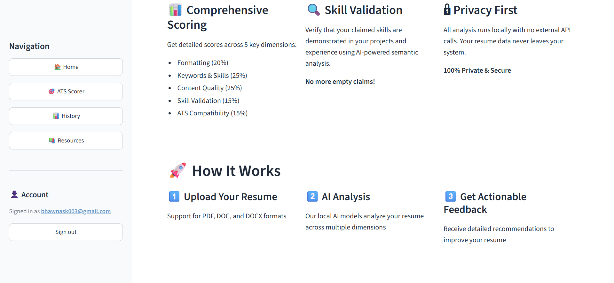
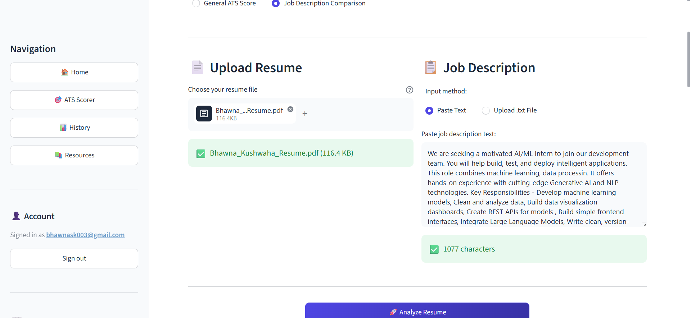
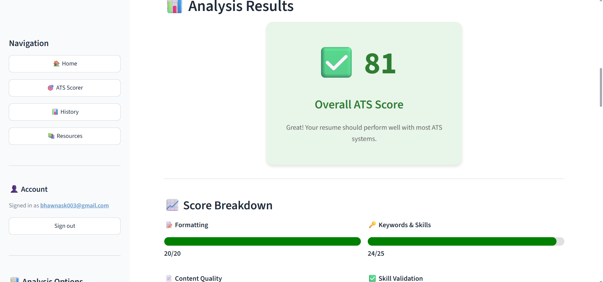
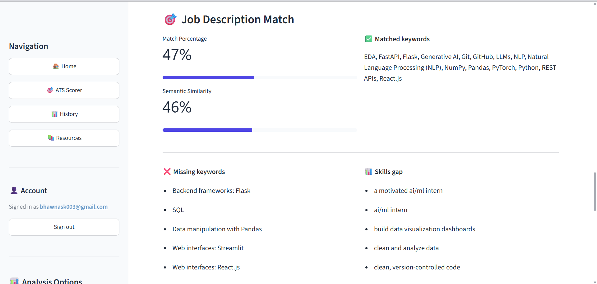
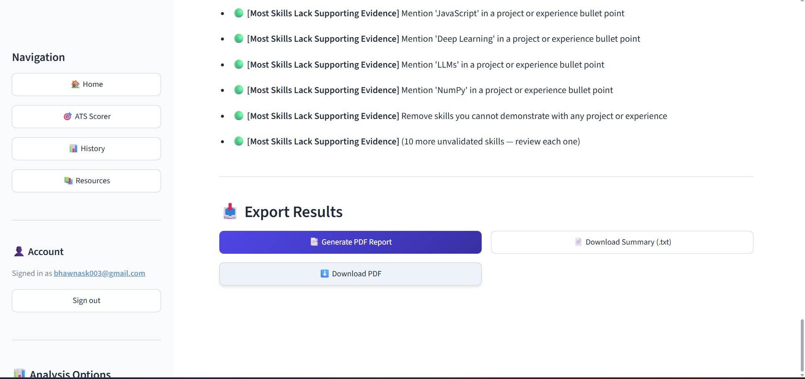
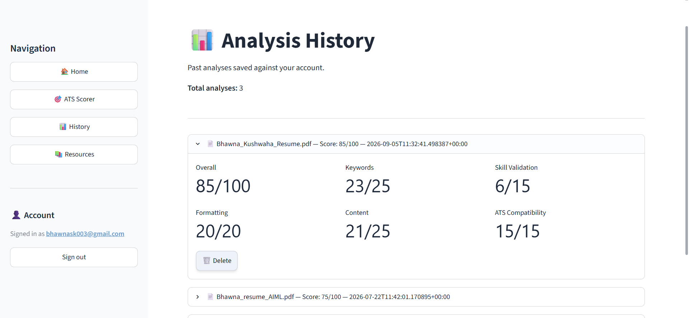
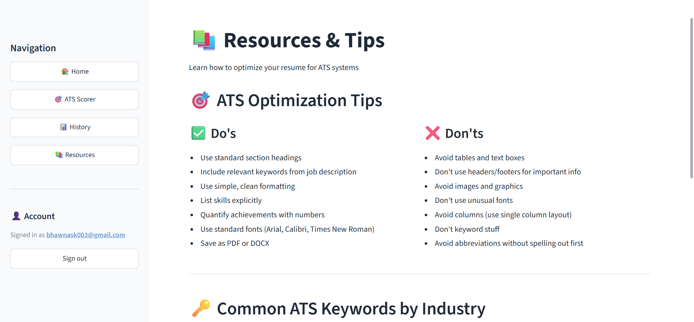
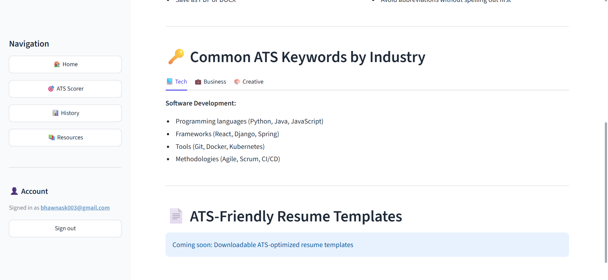

# : 🚀 BoostCV – AI Powered ATS Resume Analyzer

- BoostCV is an AI-powered ATS Resume Analyzer thats Built with FastAPI + Streamlit, using spaCy and Sentence Transformers for NLP and the Groq API for LLM-generated suggestions.

- Evaluates resumes and give ATS score, compares them against job descriptions, validates skills using semantic embeddings, and generates professional multi-page PDF reports with actionable recommendations.

---
## ✨ Features

- ATS Resume Score (0–100)
- Component-wise scoring
- Job Description Matching
- Semantic Keyword Analysis
- Skill Validation using Sentence Transformers
- Detailed Resume Feedback
- AI-generated Recommendations
- Resume Strengths & Weaknesses
- Multi-page Professional PDF Reports
- User Authentication (Supabase)
- Analysis History
- Previous Reports

---
## Tech Stack

#### Frontend

• Streamlit

#### Backend

• FastAPI (Python)

#### Machine Learning

• Sentence Transformers (all-MiniLM-L6-v2)
• spaCy (en_core_web_md)
• LLM: Groq API
• HuggingFace Transformers
• Scikit-Learn

#### Auth + Database

• Supabase

#### PDF Generation

• xhtml2pdf
• Jinja2

#### Language

Python 3.13

---
## Project structure

ATS_SCORER/
├── backend/              FastAPI app, NLP services, API routes
├── frontend/             Streamlit app, views, components
├── jupyter notebooks/    Research and dataset prep (not used at runtime)
├── model/                Exported ML artifacts
├── requirements.txt      Combined backend + frontend dependencies
└── .env.example          Template for environment variables

---
## Screenshots
---

#### Landing Page

#### ATS Score Page

#### Detailed Feedback

#### History

#### Resources

---
## Installation

git clone https://github.com/bhawnakushwaha/Boost_cv.git

cd Boost_cv

python -m venv venv

pip install -r requirements.txt

---
## Environment Variables

You will need :

A Supabase project — SUPABASE_URL, SUPABASE_KEY (service role), and SUPABASE_ANON_KEY from Project Settings → API.

A Groq API key.

(Optional) Google OAuth set up in the Supabase dashboard if you want Google sign-in.

SUPABASE_URL=

SUPABASE_KEY=

SUPABASE_JWT_SECRET=

GROQ_API_KEY=

---
## Run

##### Backend

uvicorn backend.main:app --reload --port 8000

The API is now at http://localhost:8000

##### frontend

streamlit run streamlit_app.py

The app opens at http://localhost:8501.

---
## Workflow

Authentication

↓

Upload Resume ["only resume" or with "Job Description"]

↓

Resume Parsing

↓

ATS Score

↓

Skill Validation

↓

Detailed Feedback

↓

Recommendations

↓

PDF Report

↓

History

---

